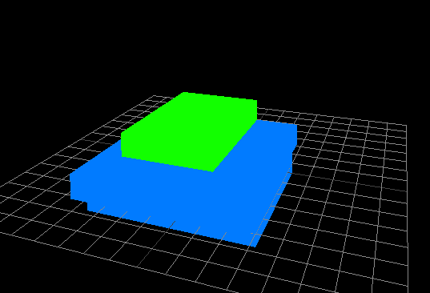
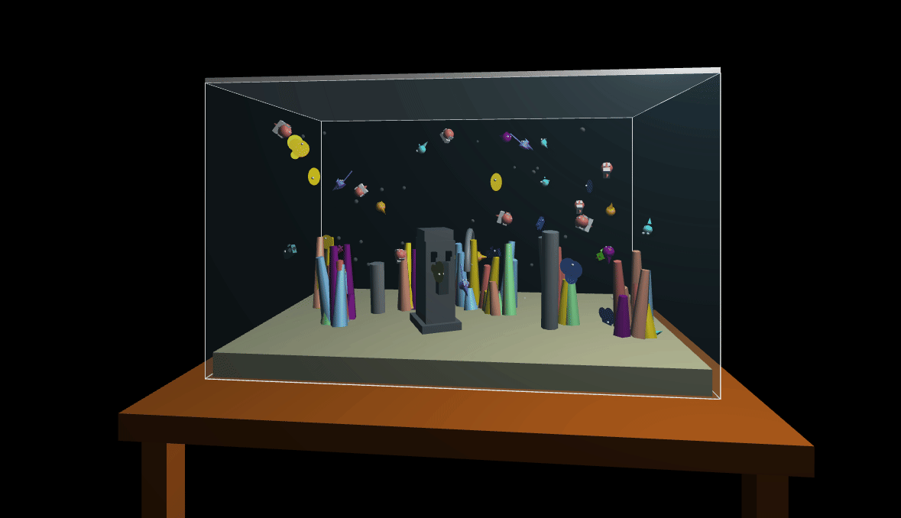

These are some demos of various simulations built using the help of generative AI. Currently there are 6 WIP demos:

# Hexagonal Terrain

# Particle Sphere 

# Light Voxel Simulator

# Smooth Terrain

# Nobody Here
### based on [nobody here](https://www.youtube.com/watch?v=-RFunvF0mDw)

# Voxel Plot 

# Voxel Aquarium

